# Curriculum Roadmap

The full graph view of the curriculum. Each phase has its own folder with notes, notebooks, and exercises.

> For the production-side roadmap (channel strategy, content calendar, internal scripts), that lives in the private companion repo.

```mermaid
flowchart TB
    START([Start · True Zero])

    subgraph P0 [Phase 0 · Foundations · 6-10 wks]
        P0A[HS Math Refresh]
        P0B[Python Basics]
        P0C[CS Mental Models]
        P0D[Dev Tools]
    end

    subgraph P1 [Phase 1 · Math for ML · 4-6 mo]
        P1A[Linear Algebra]
        P1B[Calculus and Optimization]
        P1C[Probability]
        P1D[Statistics]
        P1E[Information Theory]
        P1F[Numerical Methods]
    end

    subgraph P2 [Phase 2 · Programming for ML · 2-3 mo]
        P2A[Python Intermediate]
        P2B[NumPy and Pandas]
        P2C[Visualization]
        P2D[Git, Linux, Env Mgmt]
    end

    subgraph P3 [Phase 3 · Classical ML · 3-4 mo]
        P3A[Linear Models]
        P3B[Tree-Based]
        P3C[Kernel and SVM]
        P3D[Clustering]
        P3E[Dim Reduction]
        P3F[Eval and Feature Eng]
    end

    subgraph P4 [Phase 4 · Deep Learning · 4-6 mo]
        P4A[NN Fundamentals]
        P4B[Backprop and Optim]
        P4C[CNNs]
        P4D[RNNs and LSTMs]
        P4E[Transformers]
        P4F[Generative Models]
    end

    subgraph P5 [Phase 5 · Specializations · 3-6 mo each]
        P5A[NLP and LLMs]
        P5B[Computer Vision]
        P5C[Reinforcement Learning]
        P5D[Graph Neural Nets]
        P5E[Recommenders]
        P5F[Time Series]
        P5G[Speech and Multimodal]
    end

    subgraph P6 [Phase 6 · ML Engineering · 3-4 mo]
        P6A[MLOps]
        P6B[Deployment and Serving]
        P6C[Distributed Training]
        P6D[Inference Optimization]
        P6E[Data Engineering]
        P6F[Monitoring and A/B]
    end

    subgraph P7 [Phase 7 · ML Scientist · ongoing]
        P7A[Reading and Writing Papers]
        P7B[Frontier Topics]
        P7C[Advanced Math]
        P7D[Mech Interp and Alignment]
        P7E[Research Career]
    end

    START --> P0
    P0 --> P1
    P0 --> P2
    P1 --> P3
    P2 --> P3
    P3 --> P4
    P4 --> P5
    P4 --> P6
    P5 --> P7
    P6 --> P7
```

## Career checkpoints

| After phase | Realistic role | Portfolio expected |
|---|---|---|
| Phase 3 | ML intern, junior data scientist | 2–3 Kaggle-style projects, clean GitHub |
| Phase 4 | ML engineer (entry/mid) | 1 end-to-end DL project, one fine-tune |
| Phase 5 + 6 | ML engineer (mid/senior), applied scientist | Specialized project, deployed model, MLOps story |
| Phase 7 | Research scientist, PhD candidate | Reproduced paper, original contribution, talks |

## Per-phase folders

- [`phase-0-foundations/`](phase-0-foundations/) — math refresh + Python from zero
- [`phase-1-math/`](phase-1-math/) — linear algebra, calculus, probability, statistics, information theory
- [`phase-2-programming/`](phase-2-programming/) — the full ML programming stack
- [`phase-3-classical-ml/`](phase-3-classical-ml/) — supervised + unsupervised, evaluation, feature engineering
- [`phase-4-deep-learning/`](phase-4-deep-learning/) — neural networks, transformers, generative models
- [`phase-5-specializations/`](phase-5-specializations/) — pick one or two to go deep
- [`phase-6-ml-engineering/`](phase-6-ml-engineering/) — MLOps, deployment, scaling
- [`phase-7-research/`](phase-7-research/) — frontier topics, advanced math, research career

## How to navigate

- **Sequential learner:** start at Phase 0, read each `README.md`, do the exercises, move on.
- **Audit learner:** skim each phase's `README.md`, jump to whatever you don't know.
- **Reference user:** use this `ROADMAP.md` as a table of contents; ctrl-F is your friend.

Each phase's `README.md` opens with a "Skip this phase if…" section. Use it.
