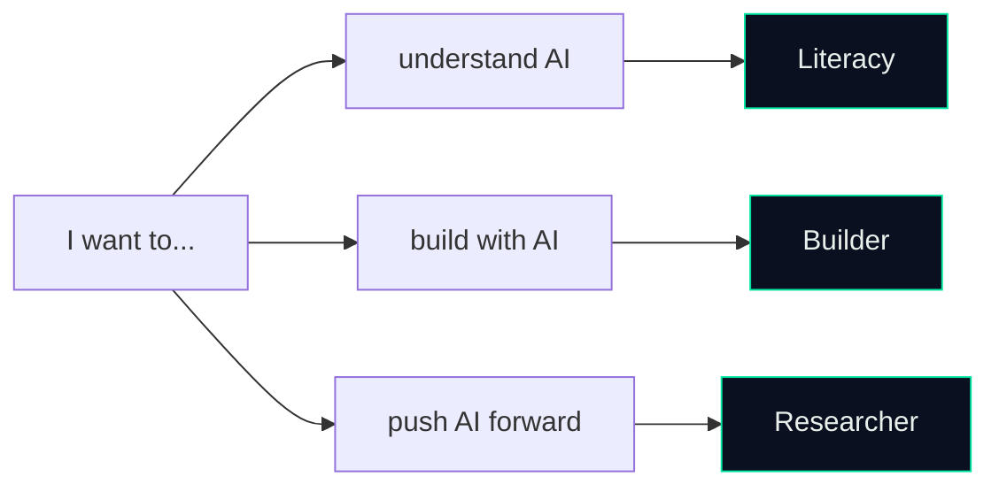

# Paths — How to Navigate

> *"Same map. Different depths. Every path is valid."*

The 7 categories (`math`, `prog`, `data`, `classical`, `dl`, `llm`, `frontier`) are the **what**. This folder is the **in what order, for whom**.

If you're starting and don't know which depth to commit to, pick a path by *role*:



---

## Literacy Track · "Understand AI"

**For:** people who want to use AI fluently, follow the field, make informed decisions. PMs, analysts, founders, curious engineers from adjacent fields.
**Total time:** ~3 months at 1–2 hrs/day.
**Stops at:** Transformers.

```
math (lighter pass)  →  classical  →  dl (through Transformers)
```

What you skip: GPU systems, MLOps internals, alignment theory, frontier research. You'll *know what these are*. You won't be expected to *do them*.

### Concretely

1. **[math](../math/)** — linear algebra + calculus + probability. Skip information theory and optimization theory for now.
2. **[classical](../classical/)** — supervised, unsupervised, model evaluation. Skip kernel methods, graphical models, RL.
3. **[dl](../dl/)** — NN theory, backprop, CNNs, sequence models, transformers. Stop here.

By the end, you can read a paper abstract, follow a conference talk, and tell hype from substance.

---

## Builder Track · "Build with AI"

**For:** engineers who want to ship products, fine-tune models, build agentic systems. The role most ML hiring targets in 2026.
**Total time:** ~8 months of dedicated study.
**Stops at:** Foundation Models.

```
math → prog → data → classical → dl → llm
```

What you skip: most of `frontier`. You'll touch scaling laws and mech interp at a literacy level; everything else lives in research.

### Concretely

1. **[math](../math/)** — full pass. Including optimization theory (you'll tune optimizers).
2. **[prog](../prog/)** — full pass. Including GPU & systems (you'll write at least one CUDA kernel).
3. **[data](../data/)** — full pass. The category most builders under-invest in.
4. **[classical](../classical/)** — full pass. XGBoost is still production-critical.
5. **[dl](../dl/)** — full pass. Implement attention from scratch.
6. **[llm](../llm/)** — full pass. This is where Builder territory peaks: pre-training (skim), alignment (deep), multimodal (skim), RAG/agents (deep).

By the end, you can ship a fine-tuned model behind a production endpoint, with monitoring, evals, and a retraining pipeline.

---

## Researcher Track · "Push AI Forward"

**For:** PhD applicants, research engineers at frontier labs, people who want to write papers and shape new architectures.
**Total time:** 18+ months — it never stops.
**Stops at:** nothing.

```
all of the above  +  frontier
```

What's different: depth, not breadth. Researchers tend to be *deeper* in 1–2 categories than Builders, while still touching every category.

### Concretely

1. Everything in the Builder track, plus:
2. **[frontier](../frontier/)** — pick a sub-track (mech interp, SSMs, MoE, safety, causal, GNNs) and go deep.
3. **Read 1 paper per week** from a single venue. Reproduce 1 paper per quarter.
4. **Write while you learn.** Blog posts → workshop papers → main-track papers.

By the end, you've submitted to a workshop, contributed to an open-source frontier repo (Hugging Face, vLLM, EleutherAI, llm-foundry), and have a research statement that survives a Stanford / MIT / Berkeley adcom read.

---

## What if I'm not sure which path?

Start with **Literacy**. After 6 weeks, you'll know whether you want to keep going. Builder and Researcher both branch off cleanly from the same first six weeks of `math` + `classical`.

The map doesn't care which path you pick. Both your career and the field reward depth over breadth.
