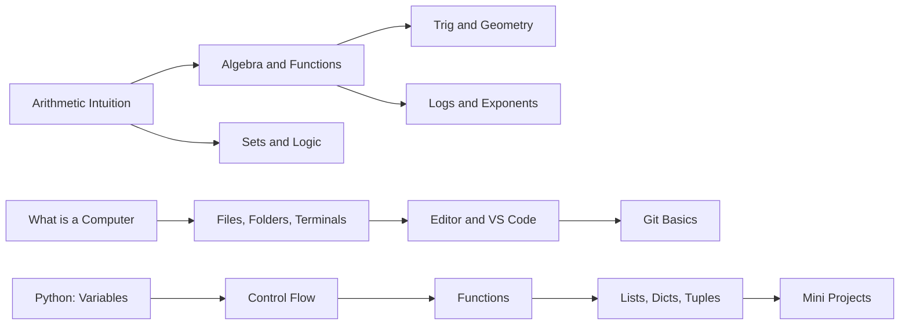

# Phase 0 · Foundations

> *"Stop being afraid of math notation. Stop being afraid of a terminal."*

This phase makes Phase 1 possible. If you skip it because "I already know Python," at least skim the math refresh — the notation we use later builds on this exact ground.

## Skip this phase if…

- You can compute the derivative of $f(x) = e^{2x} \sin(x)$ without looking it up, **and**
- you can read a CSV in Python, do a basic plot, and push to git in under 10 minutes.

If either of those is shaky, do this phase.

## What you'll learn

## Time budget

6–10 weeks at ~10 hrs/week. Closer to 4 weeks if you already know one of the three tracks (math, coding, tools).

## Track 1 — Math refresh (4–6 weeks)

- **Arithmetic intuition** — place value, fractions, percent, ratios. The boring kind that creeps back later as "why is my softmax giving NaN."
- **Algebra** — equations, inequalities, factoring.
- **Functions** — linear, quadratic, polynomial, rational. The mental model of "input → black box → output."
- **Exponentials and logarithms** — *especially* logs. You'll see them in every loss function.
- **Trigonometry** — sin/cos/tan, unit circle, identities. Light touch; only what comes back in Fourier / signal contexts.
- **Sets, logic, basic combinatorics** — for probability later.

**Notes:** `notes/01-math-refresh.md` *(coming with companion video)*
**Notebook:** `notebooks/00-math-intuition.ipynb` *(coming)*

## Track 2 — Coding from zero (4 weeks)

- Install Python (use `uv` — modern, fast), VS Code, set up your terminal.
- Variables, types, expressions.
- Control flow (if/else, loops). When to use which loop.
- Functions and scope. Why functions exist.
- Lists, dicts, tuples, sets. The four containers; pick the right one.
- Reading and writing files.
- **3 mini projects** to consolidate:
  1. CLI calculator
  2. Todo list with file persistence
  3. Word counter (any text file, top-N words)

**Notes:** `notes/02-python-from-zero.md` *(coming)*
**Notebook:** `notebooks/01-python-basics.ipynb` *(coming)*

## Track 3 — Dev tools (1–2 weeks)

- Terminal navigation (cd, ls, mkdir, mv, cp).
- Git basics (init, add, commit, push). Branches can wait.
- GitHub account → first repo.
- VS Code: the 10 keybindings worth learning.

**Notes:** `notes/03-dev-tools.md` *(coming)*

## Visual concepts (covered in companion videos)

- **Functions as morphs:** $y = f(x)$ animated as input slides; output traces.
- **Exponential vs linear growth:** 3D bars stacking side by side.
- **Unit circle:** rotating ring with sin/cos shadows.

## Exit criteria

You move on when:

- [ ] You can solve a quadratic equation on paper.
- [ ] You can read an exponent or log expression without breaking stride.
- [ ] You can write a Python function that takes a list of dicts and returns a transformed list of dicts.
- [ ] You've pushed at least one of the 3 mini projects to your own GitHub.
- [ ] You can `cd` and `ls` without thinking.

If all checked, head to [Phase 1 · Math for ML](../phase-1-math/).
