# Phase 1 · Math for ML

> *"Hold the four big ideas — vectors, gradients, distributions, and information — as visual objects, not formulas."*

## Skip this phase if…

You can answer all of these without Googling:

- What does the determinant of a matrix mean *geometrically*?
- Why does $\nabla f$ point in the direction of steepest ascent?
- What's the difference between MLE and MAP?
- What's the intuitive meaning of KL divergence?

If even one is fuzzy, do this phase. It's the longest in the whole curriculum, and it's the one that separates people who *use* ML from people who *understand* it.

## What you'll learn

```mermaid
flowchart TB
    LA[Linear Algebra]
    LA --> LA1[Vectors and Spaces]
    LA --> LA2[Matrices as Transformations]
    LA --> LA3[Eigenvalues and Eigenvectors]
    LA --> LA4[SVD and PCA]
    LA --> LA5[Inner Products and Norms]

    CA[Calculus and Optimization]
    CA --> CA1[Derivatives and Chain Rule]
    CA --> CA2[Multivariable Calculus]
    CA --> CA3[Gradients, Jacobians, Hessians]
    CA --> CA4[Convex Optimization Basics]

    PR[Probability]
    PR --> PR1[Discrete and Continuous RVs]
    PR --> PR2[Distributions]
    PR --> PR3[Joint, Marginal, Conditional]
    PR --> PR4[Bayes Theorem]

    ST[Statistics]
    ST --> ST1[MLE and MAP]
    ST --> ST2[Confidence Intervals]
    ST --> ST3[Hypothesis Testing]
    ST --> ST4[Bayesian Inference Intro]

    IT[Information Theory]
    IT --> IT1[Entropy]
    IT --> IT2[KL Divergence]
    IT --> IT3[Cross Entropy]

    NM[Numerical Methods]
    NM --> NM1[Floating Point and Stability]
```

## Time budget

4–6 months at ~10 hrs/week. Yes, it's a lot. Math is the moat.

## Priority

| Track | Priority | Why |
|---|---|---|
| Linear algebra | **Critical** | Every model is matrices acting on vectors. |
| Calculus + optimization | **Critical** | Gradient descent = applied calculus. |
| Probability | **Critical** | Models output distributions; data is noisy. |
| Statistics | **High** | Evaluation, A/B testing, confidence. |
| Information theory | **High** | Loss functions, model compression, VAEs. |
| Numerical methods | **Medium** | Why your fp16 training crashes. |

## Visual concepts (3B1B-style, covered in companion videos)

- **Vectors as arrows in 3D space**, scaling and rotating live.
- **Matrices as transformations**: unit cube morphing; determinant = volume change; rank = collapsed dimensions.
- **Eigenvectors**: axes that the transformation stretches but doesn't rotate.
- **SVD**: rotate → stretch (ellipsoid) → rotate.
- **Gradient field on a 3D surface**: arrows pointing uphill; ball rolling along $-\nabla f$.
- **Probability distributions as 3D surfaces**: joint distributions as terrain; marginalization as projecting shadow on a wall.
- **KL divergence**: two distributions, asymmetric "stretch" between them.

All animations are sourced from the open-source [ml-visuals](https://github.com/siddhant-rajhans/ml-visuals) library — feel free to embed them in your own notes.

## Recommended external resources

- **3Blue1Brown** — [*Essence of Linear Algebra*](https://www.3blue1brown.com/topics/linear-algebra), [*Essence of Calculus*](https://www.3blue1brown.com/topics/calculus)
- **Gilbert Strang** — *Introduction to Linear Algebra* (book) + MIT OCW 18.06
- **Mathematics for Machine Learning** — Deisenroth, Faisal, Ong (free PDF)
- **Boyd & Vandenberghe** — *Convex Optimization* (later chapters optional)

## Notebooks (coming)

- `notebooks/01-vectors-and-matrices.ipynb` — vectors in NumPy, broadcasting, dot products
- `notebooks/02-matrix-transformations.ipynb` — visualizing $Av$ in 2D and 3D
- `notebooks/03-eigen-and-svd.ipynb` — PCA from scratch
- `notebooks/04-gradient-descent-by-hand.ipynb` — on a simple loss
- `notebooks/05-probability-intuition.ipynb` — sampling, distributions, Bayes
- `notebooks/06-information-theory-basics.ipynb` — entropy, KL, cross-entropy

## Exit criteria

You move on when:

- [ ] You can hand-derive $\partial L / \partial W$ for a 1-layer linear regression.
- [ ] You can implement gradient descent from scratch (NumPy only) on a quadratic.
- [ ] You can explain *geometrically* what PCA is doing.
- [ ] You can derive cross-entropy from KL divergence.
- [ ] Bayes' theorem is something you reason with, not something you memorize.

Then head to [Phase 2 · Programming for ML](../phase-2-programming/).
