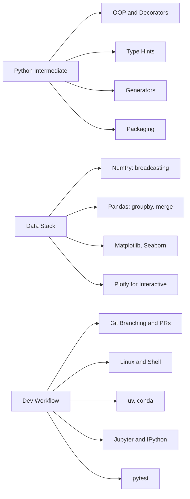

# Phase 2 · Programming for ML

> *"Stop fighting the tools. Be fluent in the stack so math is the bottleneck, not syntax."*

## Skip this phase if…

- You can vectorize a triple-nested loop into NumPy in your head, **and**
- you can read someone else's Pandas pipeline and refactor it cleaner.

## What you'll learn

## Time budget

2–3 months at ~10 hrs/week.

## Exit criteria

- [ ] Vectorize a triple-nested loop in NumPy without thinking.
- [ ] Reach for `groupby` + `agg` instead of for-loops over a DataFrame.
- [ ] Spin up a new project: `uv init`, pin deps, push to GitHub, ship a release.
- [ ] Comfortable with git branching, rebasing, and conflict resolution.
- [ ] Run a long job on a remote box via `tmux` over `ssh`.

Then head to [Phase 3 · Classical ML](../phase-3-classical-ml/).
