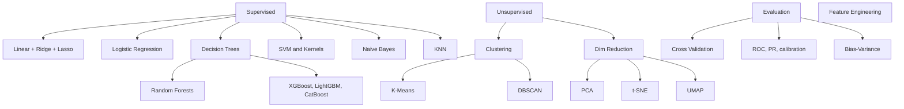

# Phase 3 · Classical ML

> *"Production ML still leans on these. Don't treat them as 'old' — treat them as the baseline you have to beat."*

## What you'll learn

## Time budget

3–4 months at ~10 hrs/week.

## Project checkpoints

- Predict house prices with Ridge + smart feature engineering.
- Build a churn model with XGBoost; explain it with SHAP.
- Cluster customers; *explain* the clusters in plain English.
- Reduce MNIST to 2D with PCA, t-SNE, UMAP — compare visually.

## Exit criteria

- [ ] Can frame any tabular problem as regression vs classification, supervised vs unsupervised.
- [ ] Understand the bias-variance tradeoff well enough to debug an overfitting model.
- [ ] Can pick a metric (and threshold) appropriate to the business cost.
- [ ] Have one Kaggle-style end-to-end project on GitHub.

Then head to [Phase 4 · Deep Learning](../phase-4-deep-learning/).
