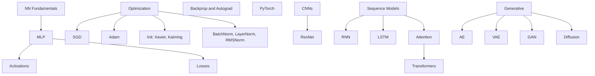

# Phase 4 · Deep Learning

> *"From a single neuron to a transformer. Build, train, debug, and reason about the loss landscape."*

## What you'll learn

## Time budget

4–6 months at ~10 hrs/week.

## Project checkpoints

- MLP on MNIST in pure NumPy (no framework).
- Same model in PyTorch, regularized to >99%.
- A CNN on CIFAR-10.
- Attention from scratch.
- A 2-layer mini-transformer trained on tiny Shakespeare.
- A VAE on faces; interpolate in latent space.

## Exit criteria

- [ ] Can read a PyTorch model definition and predict the shape of every tensor.
- [ ] Can diagnose vanishing gradients, exploding gradients, dead ReLUs.
- [ ] Have implemented attention from scratch at least once.
- [ ] Have one trained-from-scratch DL project on GitHub.

Then head to [Phase 5 · Specializations](../phase-5-specializations/).
