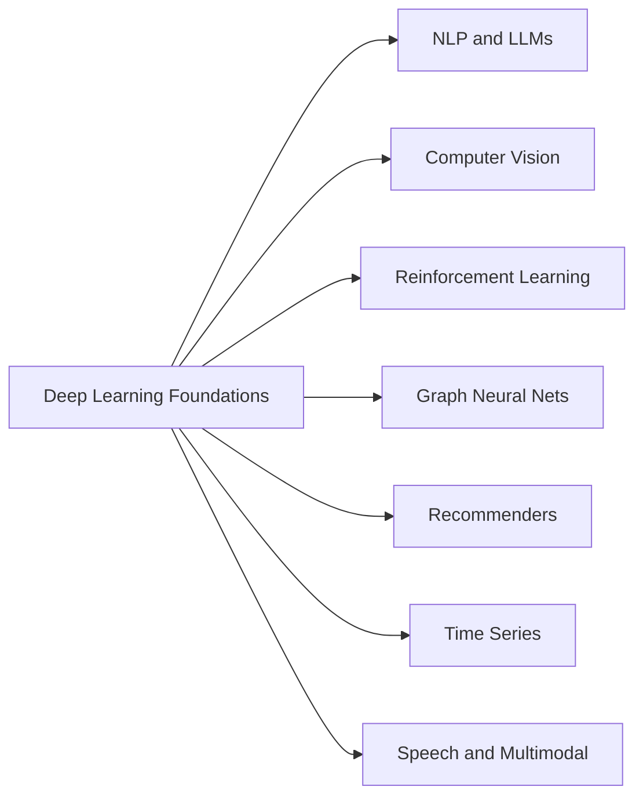

# Phase 5 · Specializations

> *"Pick one or two to go deep. Generalists are fine, but a T-shape is what gets you hired and read."*

## Tracks (pick 1–2)

Each subfolder (coming) has its own roadmap.

## Time budget

3–6 months *per specialization*.

## Sub-tracks

- `nlp-and-llms/` — tokenization → BERT/GPT → fine-tuning (LoRA, QLoRA) → RAG → RLHF/DPO → agents
- `computer-vision/` — ViT, ConvNeXt, YOLO, DETR, SAM, CLIP, video, self-supervised
- `reinforcement-learning/` — MDPs → Q-learning → PG → PPO/SAC → offline RL → model-based
- `graph-neural-nets/` — graph conv → GAT → message passing → applications
- `recommenders/` — collaborative filtering → two-tower → sequential
- `time-series/` — ARIMA → Prophet → TFT → foundation models (TimesFM)
- `speech-and-multimodal/` — Whisper → VITS → VLMs → audio diffusion

## Exit criteria (per track)

- [ ] Reproduced one foundational paper in this specialization.
- [ ] Built one project that goes beyond a tutorial — your own data, your own decisions.
- [ ] Wrote one technical blog post explaining a non-obvious result.

Then head to [Phase 6 · ML Engineering](../phase-6-ml-engineering/).
