# Phase 6 · ML Engineering

> *"A notebook is not a system. Learn what happens after `model.save()`."*

## What you'll learn

```mermaid
flowchart TB
    MLOps[MLOps] --> ET[Experiment Tracking: MLflow, W and B]
    MLOps --> Reg[Model Registry]
    MLOps --> Pipes[Pipelines: Airflow, Prefect, Dagster]

    Dep[Deployment] --> REST[REST and gRPC]
    Dep --> Server[Triton, vLLM, TGI]

    Dist[Distributed Training] --> DP[Data Parallel]
    Dist --> FSDP[FSDP, ZeRO, DeepSpeed]

    Infer[Inference Optim] --> Quant[Quantization: int8, int4]
    Infer --> Comp[ONNX, TensorRT, torch.compile]
    Infer --> KV[KV cache, paged attention]

    Data[Data Eng] --> WH[Warehouses]
    Data --> FS[Feature Stores: Feast]
    Data --> Stream[Streaming: Kafka, Flink]

    Mon[Monitoring] --> Drift
    Mon --> Fair[Fairness and Bias]
    Mon --> AB[A/B Testing]
```

## Time budget

3–4 months at ~10 hrs/week.

## Project checkpoints

- Deploy one of your Phase 4 models as a FastAPI service. Containerize. Push to a small VM.
- Add experiment tracking to a training run with W&B.
- Run a distributed training job (FSDP or DeepSpeed) on a 2-GPU rental.
- Quantize a model to int8; benchmark before/after.

## Exit criteria

- [ ] One model you trained is serving live behind an HTTP endpoint.
- [ ] Have at least one experiment dashboard you can show to a recruiter.
- [ ] Can explain a P50/P99 latency target and what affects each.

Then head to [Phase 7 · ML Scientist](../phase-7-research/).
