# Phase 7 · ML Scientist

> *"Stop consuming, start producing. Read frontier work, reproduce it, then add to it."*

## What you'll learn

```mermaid
flowchart TB
    Read[Reading Papers] --> R1[3-pass method]
    Read --> R2[Reproduce from arXiv]

    Write[Writing Papers] --> W1[LaTeX]
    Write --> W2[Submission: NeurIPS, ICML, ICLR, ACL, CVPR]

    Frontier[Frontier Topics] --> F1[Foundation Models and Scaling Laws]
    Frontier --> F2[Reasoning and Test-time Compute]
    Frontier --> F3[Multimodal and Embodied]
    Frontier --> F4[Agents]
    Frontier --> F5[World Models]

    Adv[Advanced Math] --> A1[Optimization Theory]
    Adv --> A2[Statistical Learning Theory]
    Adv --> A3[Information Geometry]
    Adv --> A4[Bayesian: VI, MCMC, Normalizing Flows]
    Adv --> A5[Causal Inference]

    Safety[Safety and Alignment] --> S1[Mech Interp]
    Safety --> S2[RLHF and DPO Theory]
    Safety --> S3[Evals and Red-teaming]
```

## Time budget

Ongoing. There's no "done."

## Project checkpoints

- Reproduce one paper from a top venue (NeurIPS / ICML / ICLR / ACL / CVPR / etc.).
- Submit one workshop paper.
- Contribute meaningfully to a known repo (Hugging Face, PyTorch, vLLM, candle, EleutherAI).

## Exit criteria

There isn't one. Welcome to research.

## External resources

- **Yannic Kilcher** — paper walkthroughs on YouTube.
- **AI Coffee Break** — accessible paper summaries.
- **Latent Space, Interconnects** — research-grade newsletters.
- **arXiv-Sanity, AlphaXiv** — paper feeds.
- **NeurIPS / ICML / ICLR / ACL / CVPR** open reviews — read what the community thinks.
